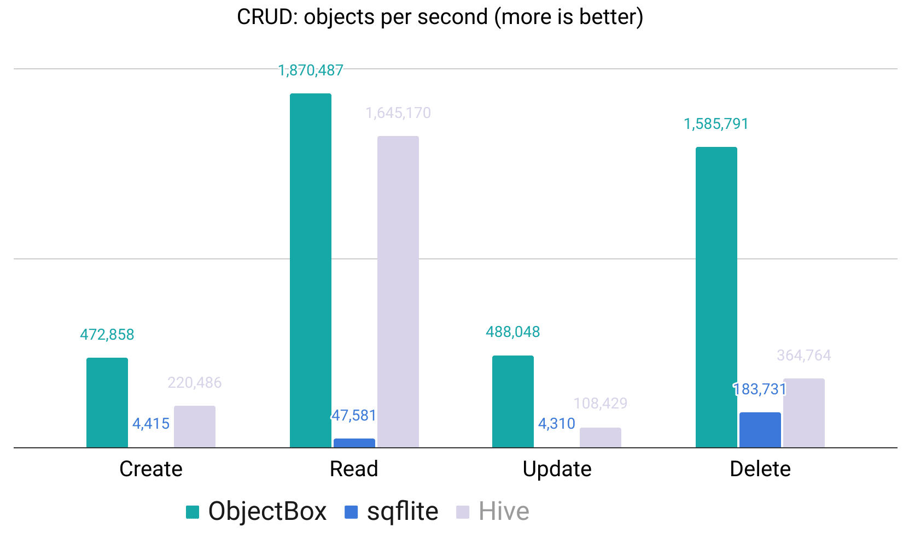

# project_objectbox

Project Flutter menggunakan [ObjectBox](https://pub.dev/packages/objectbox)

## Cara Penggunaan Repo Ini

1. Clone repo ini

```bash
git clone https://github.com/khanifzyen/project_objectbox
```

2. Pindah ke branch 01-starting-code, dan lakukan pull

```bash
git checkout -b 01-starting-code
git pull origin 01-starting-code
```

3. Pindah branch dev dan mulai kerjakan tutorial

```bash
git checkout -b dev
```

4. Lakukan commit dan push ke branch dev untuk setiap meteri yang sedang dikerjakan. Contoh:

```bash
git add .
git commit -m "initialize objectbox"
git push -u origin dev
```

5. Setelah selesai mengerjakan semua materi, buat issue baru di repository ini, untuk title diisi dengan NIM-Nama, dan content diisi dengan github repository project anda.

## Daftar isi

1. [Perkenalan](#perkenalan)
2. [Perbandingan Performa](#perbandingan-performa)

## Perkenalan

ObjectBox merupakan penyimpanan database nosql dilokal. Dirancang sebagai database berforma tinggi, ObjectBox cocok untuk aplikasi berbasis mobile dan IoT. Selain mendukung penyimpanan offline, ObjectBox juga mendukung penyimpanan yang bisa tersinkron ke antar device, sehingga menjadikan ObjectBox sebagai solusi database lokal sebagai alternatif dari hive ataupun sqflite.

Fitur yang didukung antara lain:

- 🏁 **Sangat cepat - 10X lebih cepat dibanding SQLite**: lihat benchmark performa.
- 🪂 **Sesuai standar ACID**: Atomic (Tunggal), Consistent (Konsisten), Isolated (Terisolasi), Durable (Tahan Lama).
- 💻 **Lintas platform**: Android, iOS, macOS, Linux, Windows.
- 🌱 **Scalable** - tumbuh beriringan dengan aplikasi anda, mampu menangai jutaan object dengan mudah.
- 🎯 **NoSQL database** - tidak ada baris dan kolom, hanya object Dart murni.
- 🔗 **Relations** - mendukung link / relasi.
- 💐 **Queries** - filter data yang dibutuhkan, bahkan diantara relasi.
- 📃 **Schema migration** - cukup mudah, tinggal ganti model anda, sisanya ditangani oleh ObjectBoxt.
- 😮 **Data Sync** - sinkron hanya kapan dan dimana yang dibutuhkan.

## Perbandingan Performa

Berikut adalah perbandingan performa antara ObjectBox vs sqflite vs Hive:

Gambar 1. Perbandingan Performa
